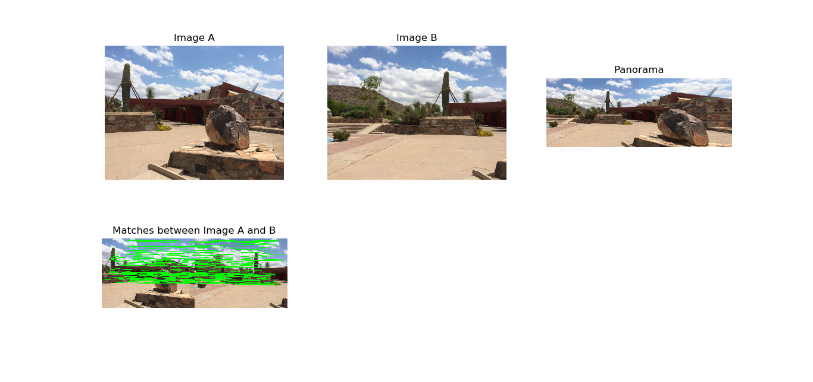

The goal of this project is to build a Computer Vision System that stitch two camera views to generate
a panorama. 

The algorithm can be described as follows: 
• Step 0: Read all the images from the images folder sorting by name 
• For every two images: 
  o Step 1: Resize images for faster processing 
  o Step 2: Detect keypoints and extract local invariant descriptors from the two images 
  o Step 3: Match the descriptors between the two images 
  o Step 4: Use RANSAC algorithm to estimate a Homography Matrix using our matched feature vectors 
  o Step 5: Apply warping transformation using the Homography Matrix obtained from Step 4 
  o Step 6: Visualize keypoint correspondences between two images 
  o Step 7: Plot the images in only one window 
  o Step 8: Remove/Reduce black edges from the Panorama if exists 
  
  
Sample 1: the panorama is not perfect so we need to apply step 8 to crop the image  

  
Sample 2: the panorama is perfect so we dont need to apply step 8  

<b>RUN:</b> type <i>python stitch.py</i> in the command line
